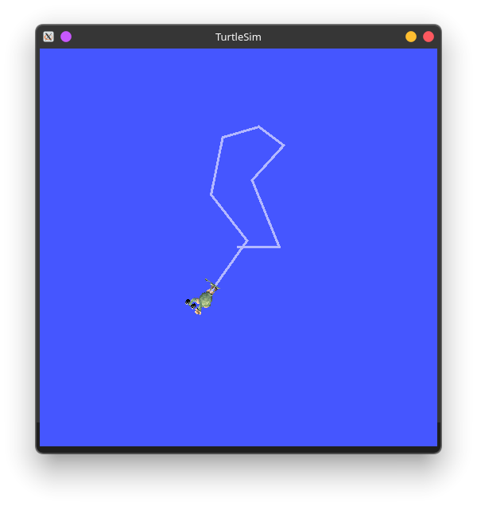
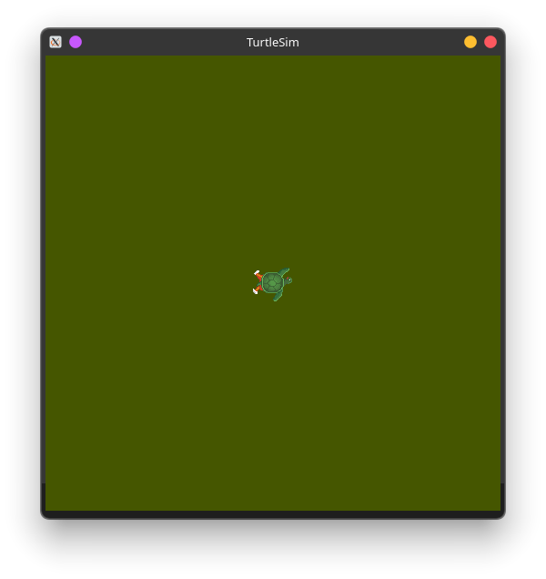
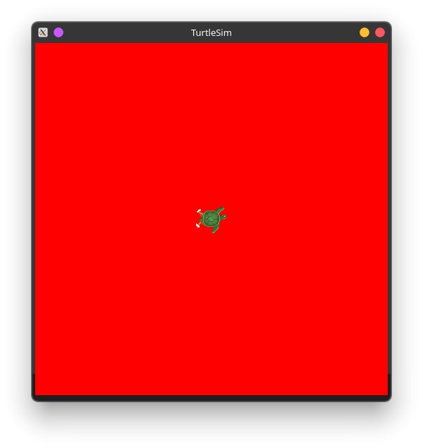

# ROS2

## Mục lục
- [1. Cấu hình môi trường](#1-cấu-hình-môi-trường)
- [2. Sử dụng turtlesim ros2 và rqt](#2-sử-dụng-turtlesim-ros2-và-rqt)
- [3. Node](#3-node)
- [4. Topic](#4-topic)
- [5. Service](#5-service)
- [6. Param](#6-param)
- [7. Action](#7-action)

## 1. Cấu hình môi trường

ROS 2 có thể dùng nhiều workspace cùng lúc:
- workspace: nơi viết, build,...
- underlay: workspace nền, thường là ROS 2 đã cài sẵn
- overlay: workspace tự tạo

### Thiết lập cơ bản
Hệ điều hành sử dụng: Kubuntu 24.04 KDE plasma 5

Hướng dẫn cài đặt ROS2 (Jazzy): https://docs.ros.org/en/jazzy/Installation/Ubuntu-Install-Debs.html

Hướng dẫn cài đặt gazebom sim (Jetty): https://gazebosim.org/docs/jetty/getstarted/

### Thêm lệnh sourcing vào tập lệnh khởi động shell:
```bash
echo "source /opt/ros/jazzy/setup.bash" >> ~/.bashrc
```

### Kiểm tra biến môi trường

```bash
printenv | grep -i ROS
```

Kết quả cần:
```bash
ROS_VERSION=2
ROS_PYTHON_VERSION=3
ROS_DISTRO=jazzy
```

### ROS_DOMAIN_ID
Là biến môi trường dùng để cô lập và phân chia mạng giao tiếp giữa các nhóm node đang chạy trên cùng một mạng vật lý

Các node cùng **ROS_DOMAIN_ID** thì nhìn thấy và giao tiếp được với nhau, khác thì không nhìn thấy nhau

```bash
export ROS_DOMAIN_ID=<your_domain_id>
```
Hoặc thêm lệnh này vào .bashrc:
```bash
echo "export ROS_DOMAIN_ID=<your_domain_id" >> ~/.bashrc
```

### ROS_AUTOMATIC_DISCOVERY_RANGE

ROS 2 có thể giao tiếp qua mạng, không chỉ máy tính
ROS_AUTOMATIC_DISCOVERY_RANGE dùng để giới hạn phạm vi tìm node

- SUBNET: mặc định, phát hiện bất kỳ nút nào có thể truy cập được
- LOCALHOST: chỉ tìm node trên cùng máy tính
- OFF: tắt, kể cả cùng máy
- SYSTEM_DEFAULT: Không thay đổi gì

### ROS_STATIC_PEERS
ROS_STATIC_PEERS: Dùng để khai báo danh sách địa chỉ máy cụ thể, ngăn cách bởi dấu `;`
Ví dụ:
```bash
export ROS_STATIC_PEERS="192.168.0.1;192.168.0.2"
```
## 2. Sử dụng `turtlesim`, `ros2` và `rqt`

- turtlesim: mô phỏng rùa đơn giản
- ros2 cli: công cụ dòng lệch chạy node, xem topic,...
- rqt: giao diện GUI thao tác ros2

### Cài đặt turtlesim
```bash
sudo apt update
sudo apt install ros2-jazzy-turtlesim
```

Kiểm tra càu đặt thành công chưa:
```bash
ros2 pkg executables turtlesim
```
Kết quả:
```
turtlesim draw_square
turtlesim mimic
turtlesim turtle_teleop_key
turtlesim turtlesim_node
```

### Bắt đầu
Khởi động turtlesim:
```bash
ros2 run turtlesim turtlesim_node
```
Kết quả:
```bash
[INFO] [1783278467.036556781] [turtlesim]: Starting turtlesim with node name /turtlesim
[INFO] [1783278467.039453937] [turtlesim]: Spawning turtle [turtle1] at x=[5,544445], y=[5,544445], theta=[0,000000]
```


### Sử dụng turtlesim

Mở terminal mới chạy:
```bash
ros2 run turtlesim turtle_teleop_key
```
Kết quả:
```bash
Reading from keyboard
---------------------------
Use arrow keys to move the turtle.
Use g|b|v|c|d|e|r|t keys to rotate to absolute orientations. 'f' to cancel a rotation.
'q' to quit.
```
Nhấn các phím mũi tên trên bàn phím để di chuyển rùa, rùa di chuyển để lại vệt trắng:


Xem các node, topic, service, action bằng cách sử dụng lệch sau:

```bash
ros2 node list
ros2 topic list
ros2 service list
ros2 action list
```

### Cài đặt rqt

```bash
sudo apt update
sudo apt install ros-jazzy-rqt ros-jazzy-rqt-common-plugins
```

Để chạy rqt:

```bash
rqt
```
Khi chạy rqt lần đầu, kết quả như bên dưới:


Chọn **Plugins > Services >Service Caller**:


Nhấn vào nút làm mới bên trái Service. Nhấn vào nút mũi tên của Service và chọn `/spawn`

Nhập nội dung như hình và bấm call:


Ta sẽ tạo được thêm một con rùa:


### Service setpen


### Điều khiển turtle2

Thêm một cửa sổ terminal khác:
```bash
ros2 run turtlesim turtle_teleop_key --ros-args --remap turtle1/cmd_vel:=turtle2/cmd_vel --remap turtle1/rotate_absolute:=turtle2/rotate_absolute
```

Điều khiển terminal 1 -> turtle1 di chuyển

Điều khiển terminal 2 -> turtle2 di chuyển

## 3. Node

### Đồ thị ros2

ROS Graph gồm:
- Node: chương trình đang chạy
- Topic: đường truyền giữa các node
- Service: request/respone giữa các node
- Action: tác vụ dài có phản hồi tiến trình
- Connection: các liên kết giữa những thành phần đó

Mỗi node nên chịu trách nhiệm cho mục đích duy nhất. Mỗi node có thể gửi và nhận dữ liệu từ node khác thông qua topic, service, action hoặc parameters

Hệ thống robot hoàn chỉnh bao gồm nhiều node hoạt động phối hợp, một tệp thực thi duy nhất có thể chứa một hoặc nhiều nút

### ros2 run

Lệnh này chạy một tệp thực thi từ gói phần mềm

```bash
ros2 run <package_name> <executable_name>
```

Ví dụ:
```bash
ros2 run turtlesim turtlesim_node
```

- `turtlesim` là gói package
- `turtlesim_node` là tên tệp thực thi

### ros2 node list

Hiển thị tên của tất cả các node đang chạy

Mở terminal 1:
```bash
ros2 run turtlesim turtlesim_node
```

Mở terminal 2:
```bash
ros2 node list
```
Kết quả:
```bash
/turtlesim
```

### remap

`remap` cho phép gán lại các giá trị thuộc tính của node

Ví dụ việc đổi tên cho node /turtlesim:
```bash
ros2 run turtlesim turtlesim_node --ros-args --remap __node:=my_turtle
```

### ros2 node info

Truy cập thêm thông tin về node bằng lệnh:
```bash
ros2 node info <node_name>
```

Ví dụ:
```bash
ros2 node info /my_turtle
```
Kết quả:
```bash
/my_turtle
  Subscribers:
    /parameter_events: rcl_interfaces/msg/ParameterEvent
    /turtle1/cmd_vel: geometry_msgs/msg/Twist
  Publishers:
    /parameter_events: rcl_interfaces/msg/ParameterEvent
    /rosout: rcl_interfaces/msg/Log
    /turtle1/color_sensor: turtlesim/msg/Color
    /turtle1/pose: turtlesim/msg/Pose
  Service Servers:
    /clear: std_srvs/srv/Empty
    /kill: turtlesim/srv/Kill
    /my_turtle/describe_parameters: rcl_interfaces/srv/DescribeParameters
    /my_turtle/get_parameter_types: rcl_interfaces/srv/GetParameterTypes
    /my_turtle/get_parameters: rcl_interfaces/srv/GetParameters
    /my_turtle/get_type_description: type_description_interfaces/srv/GetTypeDescription
    /my_turtle/list_parameters: rcl_interfaces/srv/ListParameters
    /my_turtle/set_parameters: rcl_interfaces/srv/SetParameters
    /my_turtle/set_parameters_atomically: rcl_interfaces/srv/SetParametersAtomically
    /reset: std_srvs/srv/Empty
    /spawn: turtlesim/srv/Spawn
    /turtle1/set_pen: turtlesim/srv/SetPen
    /turtle1/teleport_absolute: turtlesim/srv/TeleportAbsolute
    /turtle1/teleport_relative: turtlesim/srv/TeleportRelative
  Service Clients:

  Action Servers:
    /turtle1/rotate_absolute: turtlesim/action/RotateAbsolute
  Action Clients:
```
Nhìn vào kết quả, `ros2 node info` trả về danh sách subcribers, publishers, services và actions

## 4. Topic
Ros2 chia nhỏ hệ thống thành các module. Các topics hoạt động như một bus để trao đổi thông điệp

Một node có thể publisher bất kỳ số lượng topics và cũng subcriber từ bất kỳ số lượng topics nào.

Topic là một trong những cách truyền dữ liệu

### Thiết lập
Mở 2 terminal và lần lượt nhập:
```bash
ros2 run turtlesim turtlesim_node
```
```bash
ros2 run turtlesim turtle_teleop_key
```
### rqt graph
Mở thêm 1 terminal gõ:
```bash
ros2 run rqt_graph rqt_graph
```

Nhấn vào nút làm mới, đồ thị sẽ được cập nhật


### ros2 topic info

Kiểm tra thông tin của topic:
```bash
ros2 topic info /turtle1/cmd_vel
```
Kết quả:


```bash
ros2 topic info /turtle1/cmd_vel -v 
# Hoặc
ros2 topic info /turtle1/cmd_vel -verbose
```
Kết quả:


### loại của topic 
```bash
ros2 topic list -t
```
Kết quả:
```bash
/parameter_events [rcl_interfaces/msg/ParameterEvent]
/rosout [rcl_interfaces/msg/Log]
/turtle1/cmd_vel [geometry_msgs/msg/Twist]
/turtle1/color_sensor [turtlesim/msg/Color]
/turtle1/pose [turtlesim/msg/Pose]
```
Ví dụ `cmd_vel`:
```bash
/turtle1/cmd_vel [geometry_msgs/msg/Twist]

```
Trong package `geometry_msgs` có mục `msg` gọi là `Twist`

Chạy lệnh này để tìm hiểu chi tiết về nó:
```bash
ros2 interface show <msg_type>
```

Ví dụ:
```bash
ros2 interface show geometry_msgs/msg/Twist
```
Kết quả:
```bash
# This expresses velocity in free space broken into its linear and angular parts.

Vector3  linear
        float64 x
        float64 y
        float64 z
Vector3  angular
        float64 x
        float64 y
        float64 z
```
Cấu trúc mà `/teleop_turtle` truyền đến `/turtle_sim` bằng lệnh `echo` có cấu trúc tương tự:
```bash
linear:
  x: 2.0
  y: 0.0
  z: 0.0
angular:
  x: 0.0
  y: 0.0
  z: 0.0
---
```

### ros2  topic pub

Lệnh này dùng để publish dữ liệu lên một topic trực tiếp qua terminal, cú pháp:
```bash
ros2 topic pub <topic_name> <msg_type> '<args>'
```

Có bốn các để publish:
a. Dictionary
```bash
ros2 topic pub /turtle1/cmd_vel geometry_msgs/msg/Twist "{linear: {x: 2.0, y: 0.0, z: 0.0}, angular: {x: 0.0, y: 0.0, z: 1.8}}"
# Hoặc nếu chỉ thay đổi vận tốc tuyến tính x và vận tốc góc z
ros2 topic pub /turtle1/cmd_vel geometry_msgs/msg/Twist "{linear: {x: 2.0}, angular: {z: 1.8}}"
```
b. Empty msg
```bash
ros2 topic pub /turtle1/cmd_vel geometry_msgs/msg/Twist
```
Việc này publish giá trị mặc định cho loại message với tần số 1Hz, Tương đương với câu lệnh sai:
```bash
ros2 topic pub /turtle/cmd_vel geometry_msgs/msg/Twist "{linear: {x: 0.0, y: 0.0, z: 0.0}, angular: {x: 0.0, y: 0.0, z: 0.0}}" --rate 1
```
c. Raw
```bash
ros2 topic pub /turtle1/cmd_vel geometry_msgs/msg/Twist \'linear:\^J\ \ x:\ 0.0\^J\ \ y:\ 0.0\^J\ \ z:\ 0.0\^Jangular:\^J\ \ x:\ 0.0\^J\ \ y:\ 0.0\^J\ \ z:\ 0.0\^J\'
```

Một vài tùy chọn:

**--once**: publish 1 lần rồi thoát

**--w <so_lan>**: chờ <so_lan> publish trùng lặp rồi thoát

### ros2 topic hz

Xem tốc độ publish lên topic bằng cách:

```bash
ros2 topic hz /turtle1/pose
```

Kết quả:
```bash
average rate: 59.354
  min: 0.005s max: 0.027s std dev: 0.00284s window: 58
```

Lưu ý: tốc độ này phản ánh tốc độ nhận dữ liệu trên `subcriber` được tạo bởi lệnh, có thể bị ảnh hưởng bởi nền tảng và cấu hình QoS và không hoàn toàn trùng khớp với tốc độ của `publisher`

### ros2 topic bw

Xem băng thông của topic:

```bash
ros2 topic bw /turtle1/pose
```
Kết quả:
```bash
Subscribed to [/turtle1/pose]
1.50 KB/s from 62 messages
        Message size mean: 0.02 KB min: 0.02 KB max: 0.02 KB
```

Tương tự như topic hz, băng thông không hoàn toàn trùng khớp với băng thông của `publisher`

### ros2 topic find

Liệt kê các chủ đề có sẵn thuộc cùng một loại:
```bash
ros2 topic find <topic_type>
```

Ví dụ:
```bash
ros2 topic find geometry_msgs/msg/Twist
```

## 5. Service

Là phương thức giao tiếp giữa các node. Dựa trên mô hình call-response

### Thiết lập

Mở cửa sổ dòng lệnh chạy:
```bash
ros2 run turtlesim turtlesim_node
```

Mở một của sổ dòng lệnh khác chạy:
```bash
ros2 run turtlesim turtle_teleop_key
```

### ros2 service list
Lệnh này trả về danh sách tất cả dịch vụ hiện tại đang hoạt động trong hệ thống:
```bash
ros2 service list
```
Kết quả:
```bash
/clear
/kill
/reset
/spawn
/teleop_turtle/describe_parameters
/teleop_turtle/get_parameter_types
/teleop_turtle/get_parameters
/teleop_turtle/get_type_description
/teleop_turtle/list_parameters
/teleop_turtle/set_parameters
/teleop_turtle/set_parameters_atomically
/turtle1/set_pen
/turtle1/teleport_absolute
/turtle1/teleport_relative
/turtlesim/describe_parameters
/turtlesim/get_parameter_types
/turtlesim/get_parameters
/turtlesim/get_type_description
/turtlesim/list_parameters
/turtlesim/set_parameters
/turtlesim/set_parameters_atomically
```

### ros2 service type

Trả về kiểu mô tả cấu trúc kiểu dữ liệu yêu cầu
```bash
ros2 service type /clear
```
Kết quả:
```bash
std_srvs/srv/Empty
```
Để xem loại của tất cả dịch vụ đang hoạt động cùng một lúc, thêm tùy chọn --show-types. viết tắt -t:
```bash
ros2 service list -t
```
Kết quả:
```bash
/clear [std_srvs/srv/Empty]
/kill [turtlesim/srv/Kill]
/reset [std_srvs/srv/Empty]
/spawn [turtlesim/srv/Spawn]
/teleop_turtle/describe_parameters [rcl_interfaces/srv/DescribeParameters]
/teleop_turtle/get_parameter_types [rcl_interfaces/srv/GetParameterTypes]
/teleop_turtle/get_parameters [rcl_interfaces/srv/GetParameters]
/teleop_turtle/get_type_description [type_description_interfaces/srv/GetTypeDescription]
/teleop_turtle/list_parameters [rcl_interfaces/srv/ListParameters]
/teleop_turtle/set_parameters [rcl_interfaces/srv/SetParameters]
/teleop_turtle/set_parameters_atomically [rcl_interfaces/srv/SetParametersAtomically]
/turtle1/set_pen [turtlesim/srv/SetPen]
/turtle1/teleport_absolute [turtlesim/srv/TeleportAbsolute]
/turtle1/teleport_relative [turtlesim/srv/TeleportRelative]
/turtlesim/describe_parameters [rcl_interfaces/srv/DescribeParameters]
/turtlesim/get_parameter_types [rcl_interfaces/srv/GetParameterTypes]
/turtlesim/get_parameters [rcl_interfaces/srv/GetParameters]
/turtlesim/get_type_description [type_description_interfaces/srv/GetTypeDescription]
/turtlesim/list_parameters [rcl_interfaces/srv/ListParameters]
/turtlesim/set_parameters [rcl_interfaces/srv/SetParameters]
/turtlesim/set_parameters_atomically [rcl_interfaces/srv/SetParametersAtomically]
```
### ros2 service info
Xem thông tin dịch vụ:
```bash
ros2 service info /clear
```
Kết quả:
```bash
Type: std_srvs/srv/Empty
Clients count: 0
Services count: 2
```

Hàm trả về số lượng máy khách và máy chủ của dịch vụ đó

### ros2 service find

Tìm tất cả dịch vụ thuộc một loại cụ thể
```bash
ros2 service find std_srvs/srv/Empty
```
Kết quả:
```bash
/clear
/reset
```
### ros2 interface show

Xem cấu trúc của service
```bash
ros2 interface show <type_name>
```

Ví dụ:
```bash
ros2 interface show std_srvs/srv/Empty
```
Hoặc:
```bash
ros2 interface show turtlesim/srv/Spawn
```
kết quả:
```bash
float32 x
float32 y
float32 theta
string name # Optional.  A unique name will be created and returned if this is empty
---
string name
```

### ros2 service call

Cách để call service
```bash
ros2 service call <service_name> <service_type> <arguments>
```

Ví dụ khởi chạy `turtlesim_node` và `turtlesim_teleop_key` vẽ hình bất kỳ:



Kiểm tra service hiện tại:
``bash 
ros2 service list -t
```
Kết quả:
```bash
/clear [std_srvs/srv/Empty]
/kill [turtlesim/srv/Kill]
/reset [std_srvs/srv/Empty]
/spawn [turtlesim/srv/Spawn]
/teleop_turtle/describe_parameters [rcl_interfaces/srv/DescribeParameters]
/teleop_turtle/get_parameter_types [rcl_interfaces/srv/GetParameterTypes]
/teleop_turtle/get_parameters [rcl_interfaces/srv/GetParameters]
/teleop_turtle/get_type_description [type_description_interfaces/srv/GetTypeDescription]
/teleop_turtle/list_parameters [rcl_interfaces/srv/ListParameters]
/teleop_turtle/set_parameters [rcl_interfaces/srv/SetParameters]
/teleop_turtle/set_parameters_atomically [rcl_interfaces/srv/SetParametersAtomically]
/turtle1/set_pen [turtlesim/srv/SetPen]
/turtle1/teleport_absolute [turtlesim/srv/TeleportAbsolute]
/turtle1/teleport_relative [turtlesim/srv/TeleportRelative]
/turtlesim/describe_parameters [rcl_interfaces/srv/DescribeParameters]
/turtlesim/get_parameter_types [rcl_interfaces/srv/GetParameterTypes]
/turtlesim/get_parameters [rcl_interfaces/srv/GetParameters]
/turtlesim/get_type_description [type_description_interfaces/srv/GetTypeDescription]
/turtlesim/list_parameters [rcl_interfaces/srv/ListParameters]
/turtlesim/set_parameters [rcl_interfaces/srv/SetParameters]
/turtlesim/set_parameters_atomically [rcl_interfaces/srv/SetParametersAtomically]
```
Gọi `/clear`:
```bash
ros2 service call /clear std_srvs/srv/Empty
```
Kết quả:
```
waiting for service to become available...
requester: making request: std_srvs.srv.Empty_Request()

response:
std_srvs.srv.Empty_Response()
```
Lệnh này xoá dấu vết của turtle


### ros2 service echo
Xem quá trình truyền dữ liệu giữa server và client bằng cách:
```bash
ros2 service echo <service_name | service_type> <aruguments>
```
ros2 service echo mặc định tắt, để bật chức năng phải gọi phương thức `configure_introspection` sau khi tạo máy khách hoặc máy chủ.

Ví dụ khởi động introspection_service và introspection_clinet:
```bash
ros2 launch demo_nodes_cpp introspect_servces_launch.py
```

```bash
ros2 param set /introspection_service service_configure_introspection contents
ros2 param set /introspection_client service_configure_introspection contents
```

## 6. Param

Là giá trị dùng để cấu hình của một nút

### Thiết lập

Khởi chạy `turtlesim_node` và `turtle_teleop_key`:
```bash
# Terminal 1
ros2 run turtlesim turtlesim_node
# Terminal 2
ros2 run turtlesim turtle_teleop_key
```

### ros2 param list

Xem các param thuộc về node:
```bash
ros2 param list
``` 
Kết quả:
```bash
/teleop_turtle:
  qos_overrides./parameter_events.publisher.depth
  qos_overrides./parameter_events.publisher.durability
  qos_overrides./parameter_events.publisher.history
  qos_overrides./parameter_events.publisher.reliability
  scale_angular
  scale_linear
  start_type_description_service
  use_sim_time
/turtlesim:
  background_b
  background_g
  background_r
  holonomic
  qos_overrides./parameter_events.publisher.depth
  qos_overrides./parameter_events.publisher.durability
  qos_overrides./parameter_events.publisher.history
  qos_overrides./parameter_events.publisher.reliability
  start_type_description_service
  use_sim_time
```
### ros2 param get

Hiển thị kiểu dữ liệu và giá trị hiện tại của một tham số:


```bash
ros2 param get <node_name> <parameter_name>
```
Ví dụ:

```bash
ros2 param get /turtlesim background_b
```

Kết quả:

```bash
Integer value is: 255
```

### ros2 param set

Để thay đổi giá trị của param:

```bash
ros2 param set <node_name> <parameter_name> <value>
```

Ví dụ:

```bash
ros2 param set /turtlesim background_b 0
```
Kết quả:
```bash
Set parameter successful
```


### ros2 param dump

Xem tất cả các giá trị tham số hiện tại của một node:

```bash
ros2 param dump <node_name>
```
Ví dụ:
```bash 
# Lưu vào tệp yaml
ros2 param dump /turtlesim > examples/turtlesim.yaml
```
Kết quả `turtlesim.yaml`:
```bash
/turtlesim:
  ros__parameters:
    background_b: 0
    background_g: 86
    background_r: 69
    holonomic: false
    qos_overrides:
      /parameter_events:
        publisher:
          depth: 1000
          durability: volatile
          history: keep_last
          reliability: reliable
    start_type_description_service: true
    use_sim_time: false
```
### ros2 param load
Tải các tham số từ tệp vào node hiện tại:
```bash
ros2 param load <node_name< <parameter_file>
```
Ví dụ với file `turtlesim.yaml` với chỉnh sửa tham số `background_g: 0` `background_r: 255`:
```bash
ros2 param load /turtlesim examples/turtlesim.yaml
```
Kết quả:
```bash
Set parameter background_b successful
Set parameter background_g successful
Set parameter background_r successful
Set parameter holonomic successful
Set parameter qos_overrides./parameter_events.publisher.depth failed: parameter 'qos_overrides./parameter_events.publisher.depth' cannot be set because it is read-only
Set parameter qos_overrides./parameter_events.publisher.durability failed: parameter 'qos_overrides./parameter_events.publisher.durability' cannot be set because it is read-only
Set parameter qos_overrides./parameter_events.publisher.history failed: parameter 'qos_overrides./parameter_events.publisher.history' cannot be set because it is read-only
Set parameter qos_overrides./parameter_events.publisher.reliability failed: parameter 'qos_overrides./parameter_events.publisher.reliability' cannot be set because it is read-only
Set parameter start_type_description_service failed: parameter 'start_type_description_service' cannot be set because it is read-only
Set parameter use_sim_time successful
```


> Cảnh báo "qos_overrides", một vài tham số chỉ có thể sữa khi khởi động.

### load param khi khởi động node

Để khởi chạy một node bằng cách sử dụng các giá trị tham số đã lưu:
```bash
ros2 run <package_name> <excutable_name> --ros-args --params-file <file_name>
```

Ví dụ với turtlesim:
```bash
ros2 run turtlesim turtlesim_node --ros-args --paranms-file examples/turtlesim.yaml
```

## 7. Action

Là một giao tiếp trong ros2 dành cho tác vụ dài gồm 3 phần:
- target
- response
- result

Chức năng tương tự như service nhưng ngoại trừ các action có thể bị huỷ bỏ. Action cung cấp phản hồi liên thục thay vì chỉ trả về một phản hồi duy nhất như service

### Thiết lập

Khởi chạy turtlesim:
```bash
# Terminal 1
ros2 run turtlesim turtlesim_node
# Terminal 2
ros2 run turtlesim turtle_teleop_key
```

### Sử dụng action

Khi khởi chạy /teleop_key:
```bash
Use arrow keys to move the turtle.
Use g|b|v|c|d|e|r|t keys to rotate to absolute orientations. 'f' to cancel a rotation.
'q' to quit.
```
Khi nhấn phím bất kỳ g|b|v|c|d|e|r|t, terminal /turtlesim trả về
```bash
[INFO] [1783495269.867590558] [turtlesim]: Rotation goal completed successfully
```bash
Khi thử nhấn c, rồi nhấn f lập tức:
[INFO] [1783495364.427137927] [turtlesim]: Rotation goal canceled
```
### ros2 node info

Để xem các Action mà nút cung cấp:
```bash
ros2 node info /turtlesim
```
Kết quả;
```bash
/turtlesim
  Subscribers:
    /parameter_events: rcl_interfaces/msg/ParameterEvent
    /turtle1/cmd_vel: geometry_msgs/msg/Twist
  Publishers:
    /parameter_events: rcl_interfaces/msg/ParameterEvent
    /rosout: rcl_interfaces/msg/Log
    /turtle1/color_sensor: turtlesim/msg/Color
    /turtle1/pose: turtlesim/msg/Pose
  Service Servers:
    /clear: std_srvs/srv/Empty
    /kill: turtlesim/srv/Kill
    /reset: std_srvs/srv/Empty
    /spawn: turtlesim/srv/Spawn
    /turtle1/set_pen: turtlesim/srv/SetPen
    /turtle1/teleport_absolute: turtlesim/srv/TeleportAbsolute
    /turtle1/teleport_relative: turtlesim/srv/TeleportRelative
    /turtlesim/describe_parameters: rcl_interfaces/srv/DescribeParameters
    /turtlesim/get_parameter_types: rcl_interfaces/srv/GetParameterTypes
    /turtlesim/get_parameters: rcl_interfaces/srv/GetParameters
    /turtlesim/get_type_description: type_description_interfaces/srv/GetTypeDescription
    /turtlesim/list_parameters: rcl_interfaces/srv/ListParameters
    /turtlesim/set_parameters: rcl_interfaces/srv/SetParameters
    /turtlesim/set_parameters_atomically: rcl_interfaces/srv/SetParametersAtomically
  Service Clients:

  Action Servers:
    /turtle1/rotate_absolute: turtlesim/action/RotateAbsolute
  Action Clients:
```
### ros2 action list
```bash
ros2 action list
# Hoặc thêm -t
ros2 action list -t
```

Kết quả:
```bash
/turtle1/rotate_absolute
/turtle1/rotate_absolute [turtlesim/action/RotateAbsolute]
```
### ros2 action type

Lệnh:

```bash
ros2 action type /turtle1/rotate_absolute
```

Kết quả:

```bash
turtlesim/action/RotateAbsolute
```

Lệnh `ros2 action type` dùng để xem kiểu dữ liệu của một action.

Ở đây, action `/turtle1/rotate_absolute` có kiểu:

```bash
turtlesim/action/RotateAbsolute
```

Kiểu này cần dùng khi muốn gửi goal cho action bằng terminal hoặc khi viết code action client.

---

### ros2 action info

Lệnh:

```bash
ros2 action info /turtle1/rotate_absolute
```

Kết quả:

```bash
Action: /turtle1/rotate_absolute
Action clients: 1
    /teleop_turtle
Action servers: 1
    /turtlesim
```

Lệnh `ros2 action info` dùng để xem action đang được node nào sử dụng.

Trong đó:

* `Action clients`: node gửi yêu cầu action.
* `Action servers`: node nhận và xử lý action.

Ở ví dụ này:

```bash
/teleop_turtle
```

là action client, tức là node gửi yêu cầu quay rùa.

```bash
/turtlesim
```

là action server, tức là node nhận yêu cầu và thực hiện việc quay rùa.

---

### ros2 interface show

Trước khi gửi goal cho action, ta cần biết action đó nhận dữ liệu gì.

Lệnh:

```bash
ros2 interface show turtlesim/action/RotateAbsolute
```

Kết quả:

```bash
# The desired heading in radians
float32 theta
---
# The angular displacement in radians to the starting position
float32 delta
---
# The remaining rotation in radians
float32 remaining
```

Một action interface được chia thành 3 phần, ngăn cách bởi dấu:

```bash
---
```

Phần đầu tiên là `Goal`:

```bash
float32 theta
```

Đây là dữ liệu gửi đến action server. Với `RotateAbsolute`, ta gửi góc quay mong muốn cho rùa, đơn vị là radian.

Phần thứ hai là `Result`:

```bash
float32 delta
```

Đây là kết quả trả về sau khi action hoàn thành.

Phần thứ ba là `Feedback`:

```bash
float32 remaining
```

Đây là phản hồi trong lúc action đang chạy. Nó cho biết còn bao nhiêu góc quay nữa thì hoàn thành.

---

### ros2 action send_goal

Lệnh `ros2 action send_goal` dùng để gửi goal đến action server.

Cú pháp chung:

```bash
ros2 action send_goal <action_name> <action_type> "<goal>"
```

Ví dụ:

```bash
ros2 action send_goal /turtle1/rotate_absolute turtlesim/action/RotateAbsolute "{theta: 1.57}"
```

Kết quả có dạng:

```bash
Waiting for an action server to become available...
Sending goal:
     theta: 1.57

Goal accepted with ID: ...
Result:
    delta: ...

Goal finished with status: SUCCEEDED
```

Trong ví dụ này:

```bash
{theta: 1.57}
```

nghĩa là gửi yêu cầu cho rùa quay đến góc `1.57 rad`.

`1.57 rad` xấp xỉ bằng `90°`.

Khi goal được chấp nhận, terminal sẽ hiện:

```bash
Goal accepted
```

Khi rùa quay xong, terminal sẽ hiện:

```bash
Goal finished with status: SUCCEEDED
```

---

### Gửi goal kèm feedback

Nếu muốn xem phản hồi trong lúc action đang chạy, thêm tùy chọn:

```bash
--feedback
```

Lệnh:

```bash
ros2 action send_goal /turtle1/rotate_absolute turtlesim/action/RotateAbsolute "{theta: -1.57}" --feedback
```

Kết quả có dạng:

```bash
Sending goal:
     theta: -1.57

Goal accepted with ID: ...

Feedback:
    remaining: ...

Feedback:
    remaining: ...

Result:
    delta: ...

Goal finished with status: SUCCEEDED
```

Khi thêm `--feedback`, ta sẽ thấy giá trị `remaining` được cập nhật liên tục trong lúc rùa đang quay.

```bash
remaining
```

cho biết rùa còn phải quay thêm bao nhiêu radian nữa để tới góc yêu cầu.

---

### Hủy action đang chạy

Khi dùng node điều khiển bàn phím:

```bash
ros2 run turtlesim turtle_teleop_key
```

các phím `G|B|V|C|D|E|R|T` dùng để gửi lệnh quay rùa đến các hướng tuyệt đối.

Phím:

```bash
F
```

dùng để hủy action đang chạy.

Ví dụ, nếu nhấn `C` để rùa bắt đầu quay, sau đó nhấn nhanh `F`, action sẽ bị hủy.

Kết quả bên terminal turtlesim có thể hiện:

```bash
[INFO] [turtlesim]: Rotation goal canceled
```

Điều này cho thấy action khác với service. Service thường gửi yêu cầu rồi chờ kết quả, còn action có thể đang chạy giữa chừng và bị hủy.

---

### Action bị abort

Nếu gửi một goal mới trong khi goal cũ chưa hoàn thành, action server có thể hủy goal cũ.

Ví dụ, nhấn `D`, sau đó nhấn nhanh `G` trước khi rùa quay xong.

Kết quả có thể hiện:

```bash
[WARN] [turtlesim]: Rotation goal received before a previous goal finished. Aborting previous goal
```

`Abort` nghĩa là action server tự dừng goal trước đó.

Trong ví dụ turtlesim, khi nhận goal mới, server chọn cách hủy goal cũ. Tuy nhiên, không phải action server nào cũng xử lý giống vậy. Một action server khác có thể từ chối goal mới hoặc chờ goal cũ hoàn thành trước.

---
