# ROS2

## 1. Cấu hình môi trường

ROS 2 có thể dùng nhiều workspace cùng lúc:
- workspace: nơi viết, build,...
- underlay: workspace nền, thường là ROS 2 đã cài sẵn
- overlay: workspace tự tạo

### Thiết lập cơ bản
Hệ điều hành sử dụng: Kubuntu 24.04 KDE plasma 5

Hướng dẫn cài đặt ROS2 (Jazzy): https://docs.ros.org/en/jazzy/Installation/Ubuntu-Install-Debs.html

Hướng dẫn cài đặt gazebom sim (Jetty): https://gazebosim.org/docs/jetty/getstarted/

### Thêm lệnh sourcing vào tập lệnh khởi động shell:
```bash
echo "source /opt/ros/jazzy/setup.bash" >> ~/.bashrc
```

### Kiểm tra biến môi trường

```bash
printenv | grep -i ROS
```

Kết quả cần:
```bash
ROS_VERSION=2
ROS_PYTHON_VERSION=3
ROS_DISTRO=jazzy
```

### ROS_DOMAIN_ID
Là biến môi trường dùng để cô lập và phân chia mạng giao tiếp giữa các nhóm node đang chạy trên cùng một mạng vật lý

Các node cùng **ROS_DOMAIN_ID** thì nhìn thấy và giao tiếp được với nhau, khác thì không nhìn thấy nhau

```bash
export ROS_DOMAIN_ID=<your_domain_id>
```
Hoặc thêm lệnh này vào .bashrc:
```bash
echo "export ROS_DOMAIN_ID=<your_domain_id" >> ~/.bashrc
```

### ROS_AUTOMATIC_DISCOVERY_RANGE

ROS 2 có thể giao tiếp qua mạng, không chỉ máy tính
ROS_AUTOMATIC_DISCOVERY_RANGE dùng để giới hạn phạm vi tìm node

- SUBNET: mặc định, phát hiện bất kỳ nút nào có thể truy cập được
- LOCALHOST: chỉ tìm node trên cùng máy tính
- OFF: tắt, kể cả cùng máy
- SYSTEM_DEFAULT: Không thay đổi gì

### ROS_STATIC_PEERS
ROS_STATIC_PEERS: Dùng để khai báo danh sách địa chỉ máy cụ thể, ngăn cách bởi dấu `;`
Ví dụ:
```bash
export ROS_STATIC_PEERS="192.168.0.1;192.168.0.2"
```
## 2. Sử dụng `turtlesim`, `ros2` và `rqt`

- turtlesim: mô phỏng rùa đơn giản
- ros2 cli: công cụ dòng lệch chạy node, xem topic,...
- rqt: giao diện GUI thao tác ros2

### Cài đặt turtlesim
```bash
sudo apt update
sudo apt install ros2-jazzy-turtlesim
```

Kiểm tra càu đặt thành công chưa:
```bash
ros2 pkg executables turtlesim
```
Kết quả:
```
turtlesim draw_square
turtlesim mimic
turtlesim turtle_teleop_key
turtlesim turtlesim_node
```

### Bắt đầu
Khởi động turtlesim:
```bash
ros2 run turtlesim turtlesim_node
```
Kết quả:
```bash
[INFO] [1783278467.036556781] [turtlesim]: Starting turtlesim with node name /turtlesim
[INFO] [1783278467.039453937] [turtlesim]: Spawning turtle [turtle1] at x=[5,544445], y=[5,544445], theta=[0,000000]
```
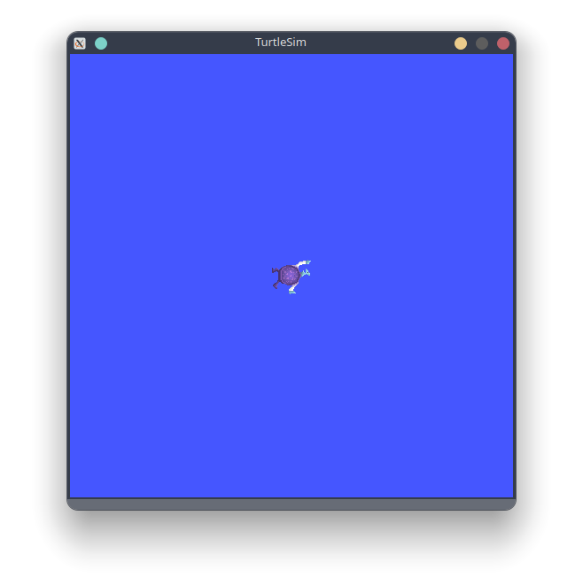

### Sử dụng turtlesim

Mở terminal mới chạy:
```bash
ros2 run turtlesim turtle_teleop_key
```
Kết quả:
```bash
Reading from keyboard
---------------------------
Use arrow keys to move the turtle.
Use g|b|v|c|d|e|r|t keys to rotate to absolute orientations. 'f' to cancel a rotation.
'q' to quit.
```
Nhấn các phím mũi tên trên bàn phím để di chuyển rùa, rùa di chuyển để lại vệt trắng:

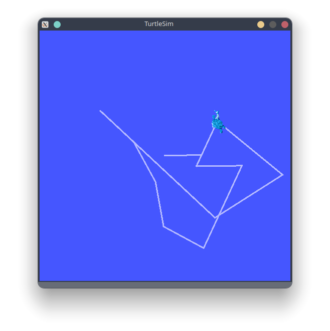

Xem các node, topic, service, action bằng cách sử dụng lệch sau:

```bash
ros2 node list
ros2 topic list
ros2 service list
ros2 action list
```

### Cài đặt rqt

```bash
sudo apt update
sudo apt install ros-jazzy-rqt ros-jazzy-rqt-common-plugins
```

Để chạy rqt:

```bash
rqt
```
Khi chạy rqt lần đầu, kết quả như bên dưới:
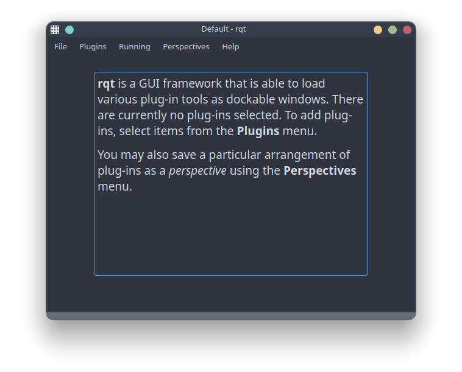

Chọn **Plugins > Services >Service Caller**:
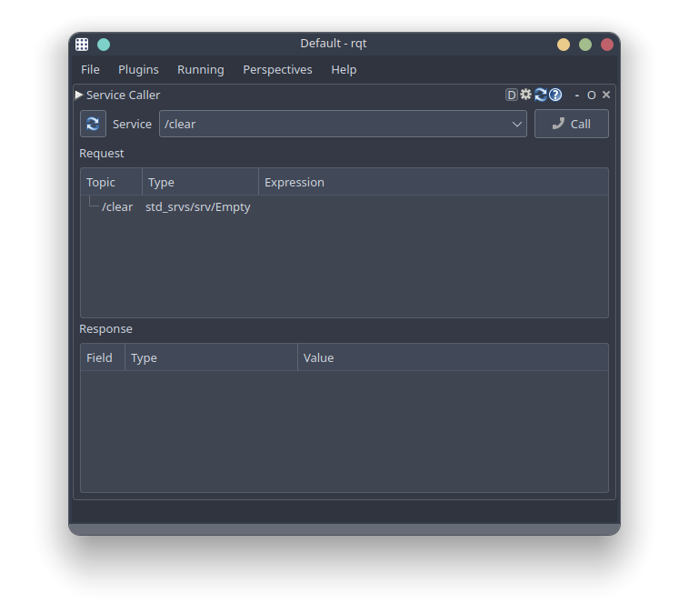

Nhấn vào nút làm mới bên trái Service. Nhấn vào nút mũi tên của Service và chọn `/spawn`

Nhập nội dung như hình và bấm call:
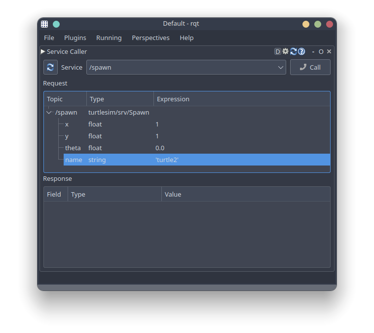

Ta sẽ tạo được thêm một con rùa:
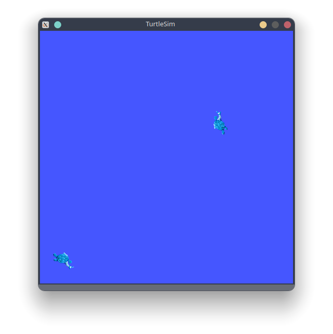

### Service setpen

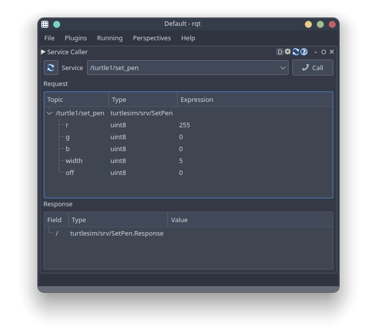

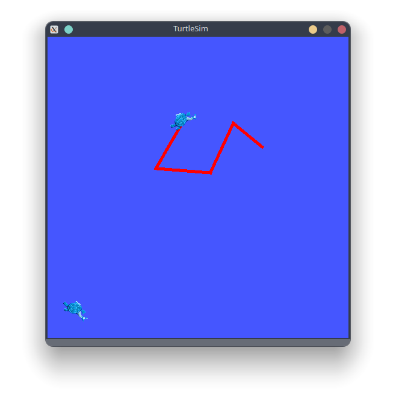


### Điều khiển turtle2

Thêm một cửa sổ terminal khác:
```bash
ros2 run turtlesim turtle_teleop_key --ros-args --remap turtle1/cmd_vel:=turtle2/cmd_vel --remap turtle1/rotate_absolute:=turtle2/rotate_absolute
```

Điều khiển terminal 1 -> turtle1 di chuyển

Điều khiển terminal 2 -> turtle2 di chuyển

## 3. Node

### Đồ thị ros2

ROS Graph gồm:
- Node: chương trình đang chạy
- Topic: đường truyền giữa các node
- Service: request/respone giữa các node
- Action: tác vụ dài có phản hồi tiến trình
- Connection: các liên kết giữa những thành phần đó

Mỗi node nên chịu trách nhiệm cho mục đích duy nhất. Mỗi node có thể gửi và nhận dữ liệu từ node khác thông qua topic, service, action hoặc parameters

Hệ thống robot hoàn chỉnh bao gồm nhiều node hoạt động phối hợp, một tệp thực thi duy nhất có thể chứa một hoặc nhiều nút

### ros2 run

Lệnh này chạy một tệp thực thi từ gói phần mềm

```bash
ros2 run <package_name> <executable_name>
```

Ví dụ:
```bash
ros2 run turtlesim turtlesim_node
```

- `turtlesim` là gói package
- `turtlesim_node` là tên tệp thực thi

### ros2 node list

Hiển thị tên của tất cả các node đang chạy

Mở terminal 1:
```bash
ros2 run turtlesim turtlesim_node
```

Mở terminal 2:
```bash
ros2 node list
```
Kết quả:
```bash
/turtlesim
```

### remap

`remap` cho phép gán lại các giá trị thuộc tính của node

Ví dụ việc đổi tên cho node /turtlesim:
```bash
ros2 run turtlesim turtlesim_node --ros-args --remap __node:=my_turtle
```

### ros2 node info

Truy cập thêm thông tin về node bằng lệnh:
```bash
ros2 node info <node_name>
```

Ví dụ:
```bash
ros2 node info /my_turtle
```
Kết quả:
```bash
/my_turtle
  Subscribers:
    /parameter_events: rcl_interfaces/msg/ParameterEvent
    /turtle1/cmd_vel: geometry_msgs/msg/Twist
  Publishers:
    /parameter_events: rcl_interfaces/msg/ParameterEvent
    /rosout: rcl_interfaces/msg/Log
    /turtle1/color_sensor: turtlesim/msg/Color
    /turtle1/pose: turtlesim/msg/Pose
  Service Servers:
    /clear: std_srvs/srv/Empty
    /kill: turtlesim/srv/Kill
    /my_turtle/describe_parameters: rcl_interfaces/srv/DescribeParameters
    /my_turtle/get_parameter_types: rcl_interfaces/srv/GetParameterTypes
    /my_turtle/get_parameters: rcl_interfaces/srv/GetParameters
    /my_turtle/get_type_description: type_description_interfaces/srv/GetTypeDescription
    /my_turtle/list_parameters: rcl_interfaces/srv/ListParameters
    /my_turtle/set_parameters: rcl_interfaces/srv/SetParameters
    /my_turtle/set_parameters_atomically: rcl_interfaces/srv/SetParametersAtomically
    /reset: std_srvs/srv/Empty
    /spawn: turtlesim/srv/Spawn
    /turtle1/set_pen: turtlesim/srv/SetPen
    /turtle1/teleport_absolute: turtlesim/srv/TeleportAbsolute
    /turtle1/teleport_relative: turtlesim/srv/TeleportRelative
  Service Clients:

  Action Servers:
    /turtle1/rotate_absolute: turtlesim/action/RotateAbsolute
  Action Clients:
```
Nhìn vào kết quả, `ros2 node info` trả về danh sách subcribers, publishers, services và actions

## 4. Topic
Ros2 chia nhỏ hệ thống thành các module. Các topics hoạt động như một bus để trao đổi thông điệp

Một node có thể publisher bất kỳ số lượng topics và cũng subcriber từ bất kỳ số lượng topics nào.

Topic là một trong những cách truyền dữ liệu

### Thiết lập
Mở 2 terminal và lần lượt nhập:
```bash
ros2 run turtlesim turtlesim_node
```
```bash
ros2 run turtlesim turtle_teleop_key
```
### rqt graph
Mở thêm 1 terminal gõ:
```bash
ros2 run rqt_graph rqt_graph
```

Nhấn vào nút làm mới, đồ thị sẽ được cập nhật
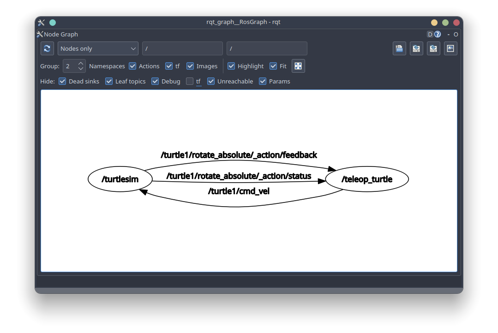

### ros2 topic info

Kiểm tra thông tin của topic:
```bash
ros2 topic info /turtle1/cmd_vel
```
Kết quả:

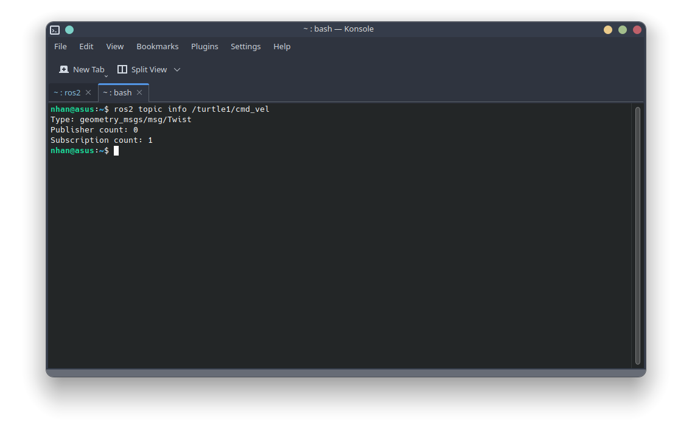
```bash
ros2 topic info /turtle1/cmd_vel -v 
# Hoặc
ros2 topic info /turtle1/cmd_vel -verbose
```
Kết quả:

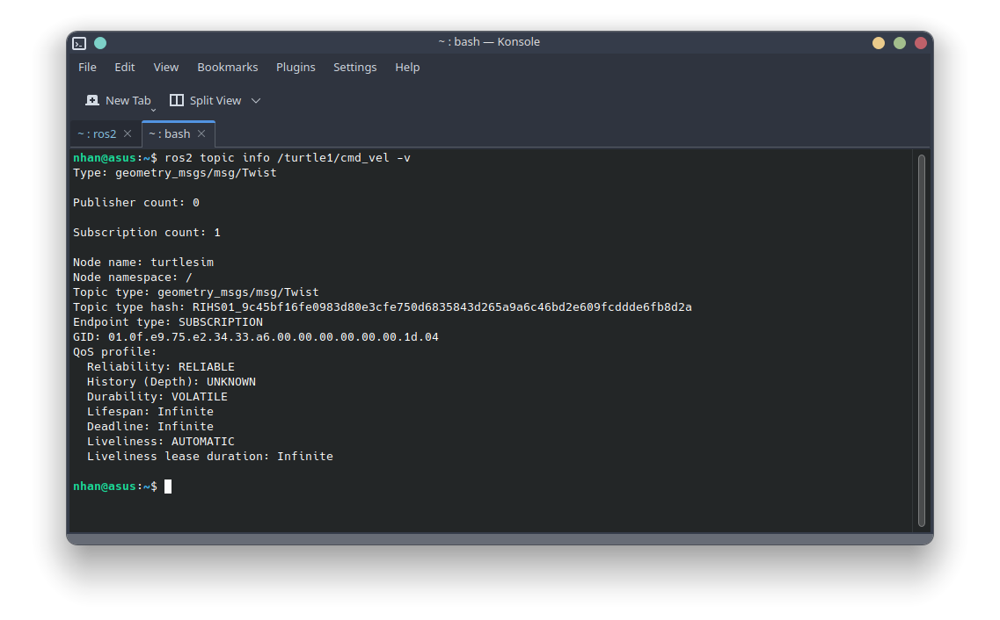

### loại của topic 
```bash
ros2 topic list -t
```
Kết quả:
```bash
/parameter_events [rcl_interfaces/msg/ParameterEvent]
/rosout [rcl_interfaces/msg/Log]
/turtle1/cmd_vel [geometry_msgs/msg/Twist]
/turtle1/color_sensor [turtlesim/msg/Color]
/turtle1/pose [turtlesim/msg/Pose]
```
Ví dụ `cmd_vel`:
```bash
/turtle1/cmd_vel [geometry_msgs/msg/Twist]

```
Trong package `geometry_msgs` có mục `msg` gọi là `Twist`

Chạy lệnh này để tìm hiểu chi tiết về nó:
```bash
ros2 interface show <msg_type>
```

Ví dụ:
```bash
ros2 interface show geometry_msgs/msg/Twist
```
Kết quả:
```bash
# This expresses velocity in free space broken into its linear and angular parts.

Vector3  linear
        float64 x
        float64 y
        float64 z
Vector3  angular
        float64 x
        float64 y
        float64 z
```
Cấu trúc mà `/teleop_turtle` truyền đến `/turtle_sim` bằng lệnh `echo` có cấu trúc tương tự:
```bash
linear:
  x: 2.0
  y: 0.0
  z: 0.0
angular:
  x: 0.0
  y: 0.0
  z: 0.0
---
```

### ros2  topic pub

Lệnh này dùng để publish dữ liệu lên một topic trực tiếp qua terminal, cú pháp:
```bash
ros2 topic pub <topic_name> <msg_type> '<args>'
```

Có bốn các để publish:
a. Dictionary
```bash
ros2 topic pub /turtle1/cmd_vel geometry_msgs/msg/Twist "{linear: {x: 2.0, y: 0.0, z: 0.0}, angular: {x: 0.0, y: 0.0, z: 1.8}}"
# Hoặc nếu chỉ thay đổi vận tốc tuyến tính x và vận tốc góc z
ros2 topic pub /turtle1/cmd_vel geometry_msgs/msg/Twist "{linear: {x: 2.0}, angular: {z: 1.8}}"
```
b. Empty msg
```bash
ros2 topic pub /turtle1/cmd_vel geometry_msgs/msg/Twist
```
Việc này publish giá trị mặc định cho loại message với tần số 1Hz, Tương đương với câu lệnh sai:
```bash
ros2 topic pub /turtle/cmd_vel geometry_msgs/msg/Twist "{linear: {x: 0.0, y: 0.0, z: 0.0}, angular: {x: 0.0, y: 0.0, z: 0.0}}" --rate 1
```
c. Raw
```bash
ros2 topic pub /turtle1/cmd_vel geometry_msgs/msg/Twist \'linear:\^J\ \ x:\ 0.0\^J\ \ y:\ 0.0\^J\ \ z:\ 0.0\^Jangular:\^J\ \ x:\ 0.0\^J\ \ y:\ 0.0\^J\ \ z:\ 0.0\^J\'
```

Một vài tùy chọn:

--once: publish 1 lần rồi thoát

--w <so_lan>: chờ <so_lan> publish trùng lặp rồi thoát

### ros2 topic hz

Xem tốc độ publish lên topic bằng cách:

```bash
ros2 topic hz /turtle1/pose
```

Kết quả:
```bash
average rate: 59.354
  min: 0.005s max: 0.027s std dev: 0.00284s window: 58
```

Lưu ý: tốc độ này phản ánh tốc độ nhận dữ liệu trên `subcriber` được tạo bởi lệnh, có thể bị ảnh hưởng bởi nền tảng và cấu hình QoS và không hoàn toàn trùng khớp với tốc độ của `publisher`

### ros2 topic bw

Xem băng thông của topic:

```bash
ros2 topic bw /turtle1/pose
```
Kết quả:
```bash
Subscribed to [/turtle1/pose]
1.50 KB/s from 62 messages
        Message size mean: 0.02 KB min: 0.02 KB max: 0.02 KB
```

Tương tự như topic hz, băng thông không hoàn toàn trùng khớp với băng thông của `publisher`

### ros2 topic find

Liệt kê các chủ đề có sẵn thuộc cùng một loại:
```bash
ros2 topic find <topic_type>
```

Ví dụ:
```bash
ros2 topic find geometry_msgs/msg/Twist
```

